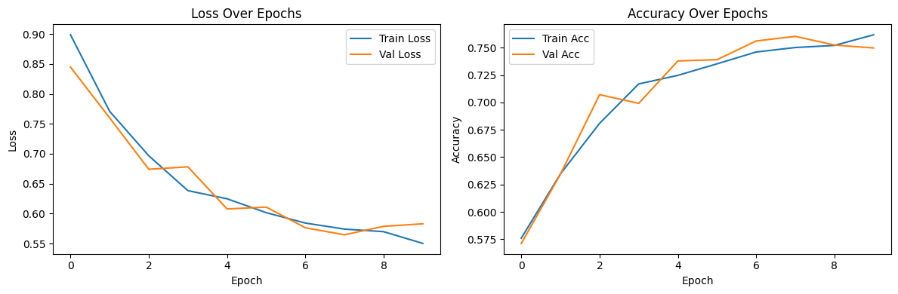

# 🧠 U-Net Image Segmentation (Oxford-IIIT Pet Dataset)

This project implements a **U-Net architecture** using **TensorFlow/Keras** to perform **pixel-wise image segmentation** on the **Oxford-IIIT Pet Dataset**. The model classifies each pixel in an image as part of a pet, the background, or a boundary.

---

## 🎯 Objective

> Segment pet images to classify pixels into three categories — **pet**, **background**, and **border** — using the U-Net model.

---

## ✅ Features

- 📦 Loads and preprocesses the Oxford-IIIT Pet Dataset
- 🧠 Implements a custom U-Net model from scratch in Keras
- 🧹 Uses data normalization and label transformation
- 🏋️‍♂️ Trains the model with `sparse_categorical_crossentropy`
- 📈 Visualizes training loss and accuracy
- 🎯 Predicts segmentation masks and overlays results
- 💾 Saves model in native `.keras` format

---

## 🛠️ Tech Stack

- Python 3.x
- TensorFlow 2.x
- TensorFlow Datasets (`tfds`)
- Matplotlib
- NumPy

---

## 🗂️ Dataset

**Oxford-IIIT Pet Dataset**  
- 3-class segmentation: pet, background, boundary  
- 3,680 images of 37 pet breeds  
- Source: [https://www.robots.ox.ac.uk/~vgg/data/pets](https://www.robots.ox.ac.uk/~vgg/data/pets)

---

## 🧠 Model Architecture (U-Net)

```text
Input → [Conv2D + MaxPool] × 2 → Bottleneck → [Conv2DTranspose] × 2 → Softmax
```

---

## 📈 Training Metrics

| Metric        | Value         |
|---------------|---------------|
| Optimizer     | Adam          |
| Loss Function | Sparse Categorical Crossentropy |
| Epochs        | 10            |
| Batch Size    | 64            |
| Input Size    | 128x128x3     |
| Output Classes| 3 (Pet, Background, Border) |

---

## 📊 Results

### 🔹 Loss & Accuracy Plots

> Line plots showing model improvement over training:



